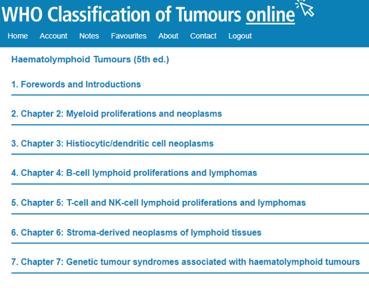
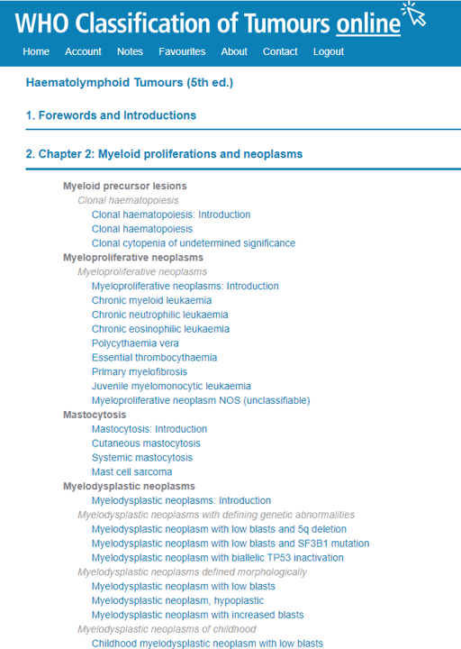
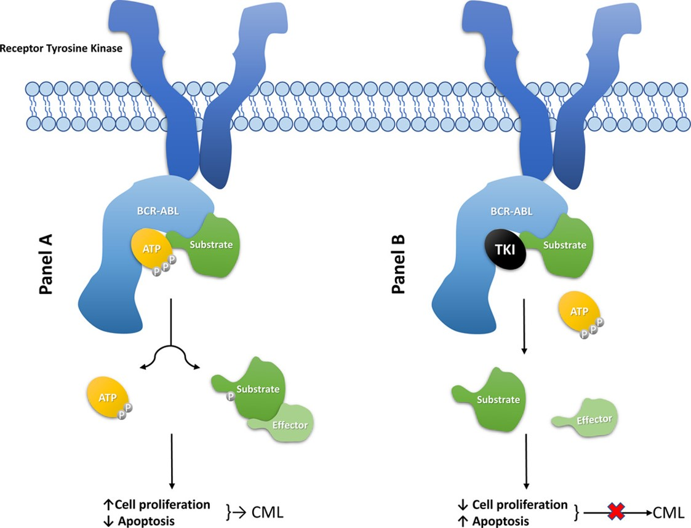
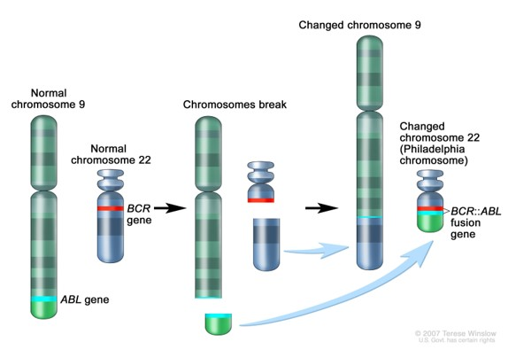
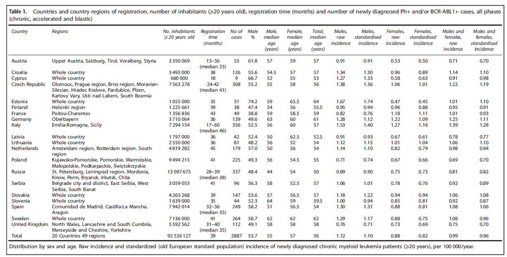
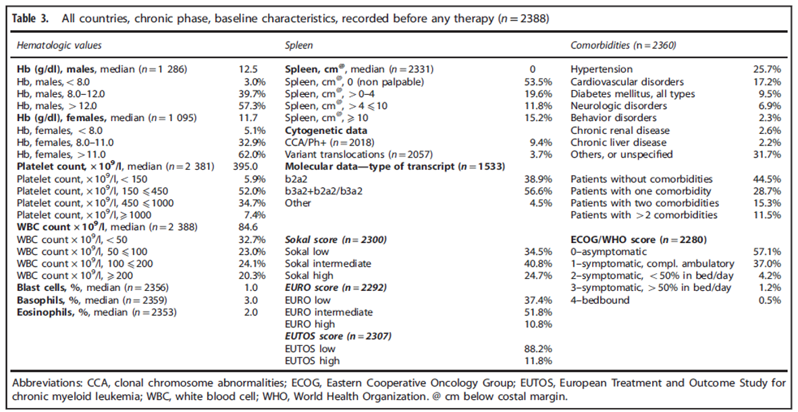

前段时间有一个与血液肿瘤临床医生合作的科研项目，借此机会系统的了解下血液肿瘤相关的临床知识，主要参考的的是[WHO最新发布的第五版血液肿瘤分类](https://www.nature.com/articles/s41375-022-01620-2)。本文主要记录其中的Chronic Myeloid Leukaemia(CML)的相关知识。

## WHO 血液肿瘤分类标准

WHO Classification of Tumors 首先将肿瘤大类进行划分，血液肿瘤作为单独一个目录 (Haematolymphoid Tumours)。

在血液肿瘤目录下，再划分出7个章节，包含常说的淋系和髓系肿瘤。本文介绍的CML属于髓系增殖和肿瘤 (Myeloid proliferations and neoplasms)。

在髓系增殖和肿瘤目录下，CML属于髓系增殖性肿瘤（Myeloproliferative neoplasms）的一个主要类别，在髓系肿瘤中也是较为常见的类型。

  
  
  
WHO 血液肿瘤目录结构

## Definition

> CML is a MPN defined by the BCR::ABL1 fusion gene and characterized by neutrophilic granulocytosis.

很明确的定义，需要有BCR::ABL1的融合变异，细胞水平的特点是中性粒细胞增多。

## Localization

> - In CP, the neoplastic cells are mostly confined to the blood, bone marrow, spleen, and liver.
>
> - In BP, the blasts can infiltrate any extra­medullary site, with a predilection for the spleen, liver, lymph nodes, skin, and soft tissues.

chronic phase (CP): 慢性期，blast phase (BP): 爆发期

## Clinical features

> - Most patients (> 95%) with CML are diagnosed in CP, which usually has an insidious onset. Some newly diagnosed cases can be asymptomatic and discovered when a blood count is performed as part of a routine medical examination. Common findings at presentation include splenomegaly, fatigue, malaise, weight loss, night sweats, and anaemia.
>
> - Untreated, most cases of CML progress from CP to an advanced phase within a few years after diagnosis. Progression is characterized clinically by declining performance status; constitutional signs such as fever and weight loss; and symptoms related to severe anaemia, thrombocytopenia, increased white blood cell count, and splenic enlargement.
>
> - The natural history of untreated CML before the introduction of the targeted tyrosine kinase inhibitor (TKI) was biphasic or triphasic: an initial indolent CP followed by an accelerated phase (AP) and/or BP. The designation “AP” is less useful in the TKI era, as discussed below, and it is now called “high-risk chronic phase”, which may be identified at presentation or during the course of the disease while the patient is on TKI therapy.

- 大多数CML都是在CP阶段发现，借助的是一些常规的生化检查。
- 未经治疗的CML大多会在数年后进入晚期。
- CML的发展分为2/3个阶段：CP -> high-risk chronic phase -> BP。其中BP阶段不一定会出现。

tyrosine kinase inhibitor (TKI): 酪氨酸酶抑制剂，用于抑制BCR-ABL1融合基因无休止的编码蛋白的过程。

  
  
TKI 原理卡通图

  
  
BCR-ABL 融合

## Epidemiology

> Worldwide, CML has an annual incidence of 1–2 cases per 100 000 population, with a slight male predominance and increasing incidence by aging

## Etiology

> The predisposing factors for CML are largely unknown with little, if any, inherited predisposition.

病因学上，CML的诱发因素还未知，原子弹爆炸导致的急性辐射暴露是有研究说是有相关性的。基本不存在遗传因素的诱发。

## Pathogenesis

> - 90–95% of cases of CML have the characteristic t(9;22)(q34;q11.2) reciprocal translocation that results in the so-called Philadelphia (Ph) chromosome.
>
> - It is generally accepted that the increased tyrosine kinase activity of BCR::ABL1 is necessary and sufficient to cause CML-CP through constitutive activation of proteins in several signal transduction pathways.
>
> - The understanding of the abnormal signalling in CML cells led to the design and synthesis of small molecules that target the tyrosine kinase activity of BCR::ABL1, of which imatinib was the first to be successfully used to treat CML.
>
> - Transformation to BP is usually associated with clonal evolution, with 70–80% of cases demonstrating additional chromosomal aberrations (ACAs) besides the Ph chromosome. There is general agreement that 3q26.2 (MECOM) rearrangements, monosomy 7, isochromosome 17q, and complex karyotypes (high-risk ACAs) are associated with an increased risk of progression to BP.
>
> - Genes reported to be altered in the transformed stages include TP53, RB1, MYC, CDKN2A, NRAS, KRAS, RUNX1, TET2, CBL, ASXL1, IDH1, and IDH2, but their exact role in transformation is unknown.

Philadelphia (Ph) chromosome: 费城染色体，上世纪五十年代由宾大的两位科学家发现的染色体易位现象，即BCR-ABL1基因融合。

发展到BP阶段的CML大多都会出现克隆性的染色体水平的畸变。

基因水平上，有多个基因的变异被发现与病程相关，但是具体对上下游通路的影响还没研究清楚。

下面展示了[2015年发表的对于欧洲人群大队列的CML研究](https://www.nature.com/articles/leu201573)中的两张table，指南中的流行病学，发病机制等段落的描述都多次引用该文章：

  
  
不同国家的维度展示该研究的队列数，粗发生率，标准发生率等信息

  
  
CML baseline阶段的各项指标，包含生化，脾脏，分子数据，各个风险体系的得分，并发症。

## Histopathology

> - Chronic phase: The peripheral blood shows leukocytosis. The bone marrow is hypercellular. Reticulin fibrosis of the bone marrow may be seen in as many as 30% of cases at diagnosis.
>
> - Blast phase:
>   - Detection of ≥ 20% myeloid blasts in peripheral blood or bone marrow, or
>   - Presence of an extramedullary blast proliferation, or
>   - Detection of lymphoblasts in peripheral blood or bone marrow (even if < 10%)

Reticulin fibrosis: 网状纤维化

myeloid blasts: 骨髓母细胞

extramedullary blast proliferation：髓外原始细胞增殖

## Diagnostic molecular pathology

> - Molecular diagnostics
>   - BCR::ABL1 exists in several different isoforms depending on the precise position of the t(9;22)(q34;q11.2) genomic breakpoints. The two most common isoforms are known as e13a2 and e14a2, i.e. BCR exon 13 and BCR exon 14, respectively, spliced to ABL1 exon 2, account for 98% of CML cases.
> - Cytogenetic analysis and FISH
>   - Cytogenetic evaluation identifies t(9;22)(q34;q11.2) and the Ph chromosome in nearly 85–90% of cases. A variant translocation is detected in 5–10% of cases.

主要是通过分子和细胞遗传学这两种方式检测费城染色体，从而确诊。

基因组水平的方式一般存在两种BCR断点的位置（exon 13和exon 14）。

## Essential and desirable diagnostic criteria

> - Essential: peripheral blood neutrophilic leukocytosis; detection of the Ph chromosome and/or BCR::ABL1 by cytogenetic and/or other molecular genetic techniques.
>
> - Desirable: bone marrow evaluation at diagnosis or at suspected progression for assessment of disease phase; evaluation for ACAs.

neutrophilic leukocytosis: 中性粒细胞增多症

与CML的定义是符合的，理想情况下是通过骨髓评估推测病程阶段。

## Prognosis and prediction

>   - Therapeutic milestones have been developed by the European LeukemiaNet (ELN) to categorize treatment response during treatment as “optimal”, “warning”, or “failure”.
>   - Overall, the complete cytogenetic response rate to imatinib is 70–90%, with 5-year progression-free and overall survival rates of 80–95%.
>   - The achievement of a stable deep molecular response, defined as a 4-log reduction in tumour load as measured by qRT-PCR adjusted to the IS (BCR::ABL1IS ≤ 0.01%) and sustained for at least a year, is a prerequisite for trials of treatment discontinuation.
>   - Several studies have confirmed that about 50% of patients can then remain off treatment indefinitely; this is known as treatment-free remission.
>   - In this edition, AP at diagnosis or during treatment has been omitted, with only CP and BP now recognized as CML phases.
>   - High-risk features include:
>       - ≥ 10% blasts in peripheral blood and/or bone marrow
>       - ≥ 20% basophils in peripheral blood
>       - Additional chromosomal abnormalities in Ph+ cells

basophils: 嗜碱粒细胞

需要注意的是，这里的“prediction”是指已确诊患者的治疗反应和长期预后，而不是早筛预测或针对未确诊人群的风险预测。

## 小结

这篇文档记录了我在阅读WHO血液肿瘤第五版蓝皮书时的收获，第2节到第11节与WHO中的CML介绍的章节顺序是一致的。原文的描述会更详细一些，但也是非常的精炼了，阅读难度不大，很适合入门特定癌种的临床知识。

## References

1. Nagar, B., Hantschel, O., Young, M. A., Scheffzek, K., Veach, D., Bornmann, W., ... & Kuriyan, J. (2003). Structural basis for the autoinhibition of c-Abl tyrosine kinase. *Cell*, 112(6), 859-871. https://doi.org/10.1016/s0092-8674(03)00194-6

2. Manouchehri, A., Kanu, E., Mauro, M. J., Aday, A. W., Lindner, J. R., & Moslehi, J. (2020). Tyrosine Kinase Inhibitors in Leukemia and Cardiovascular Events: From Mechanism to Patient Care. *Arterioscler Thromb Vasc Biol*, 40(2), 301-308. https://doi.org/10.1161/atvbaha.119.313353

3. Hoffmann, V. S., Baccarani, M., Hasford, J., Lindoerfer, D., Burgstaller, S., Sertic, D., ... & Hehlmann, R. (2015). The EUTOS population-based registry: incidence and clinical characteristics of 2904 CML patients in 20 European Countries. *Leukemia*, 29(6), 1336-1343. https://doi.org/10.1038/leu.2015.73

4. Alaggio, R., Amador, C., Anagnostopoulos, I., Attygalle, A. D., Araujo, I. B. d. O., ... & Xiao, W. (2022). The 5th edition of the World Health Organization Classification of Haematolymphoid Tumours: Lymphoid Neoplasms. *Leukemia*, 36(7), 1720-1748. https://doi.org/10.1038/s41375-022-01620-2
