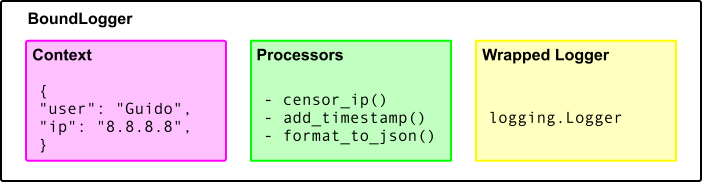
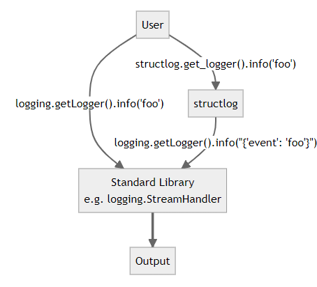

[structlog](https://www.structlog.org/en/stable/) 是一款优化 python 自带的 logging 库的第三方模块，通过结构化的 logging 信息（键值对），避免重复和繁琐的日志记录过程，保持日志信息的一致性。

官方的文档写的是很清晰的，对于production-grade logging不熟悉的通过官方文档会有一个全面的了解，这篇文档主要记录我认为实用的一些功能。

## [Building a Context](https://www.structlog.org/en/stable/getting-started.html#building-a-context)

structlog 提供了便捷的方式来创建 context，丰富日志信息。相比于原生的 logging，能更好维护日志的一致性和完整性，减少了每次记录日志时重复传递相同信息的需要。

需要注意的是这里介绍了`.bind()`和`structlog.contextvars.bind_contextvars()`两种方法，使用场景需要区分：

- `.bind()` 方法的作用域限于返回的新日志记录器实例。如果你在一个函数或模块中创建了一个绑定了特定上下文的日志记录器，那么这个上下文只在使用该实例的地方有效。
- `bind_contextvars()` 则利用 Python 的 `contextvars` 模块，在线程或异步任务的本地存储中绑定上下文变量。这意味着无论在何处（跨函数、模块甚至是线程），只要是在同一上下文中，绑定的变量都是可访问的。
- 使用 `bind_contextvars()` 绑定的变量，可以在日志记录中全局访问，而无需每次调用日志函数时都重新绑定。

## [structlog and Standard Library’s logging](https://www.structlog.org/en/stable/getting-started.html#structlog-and-standard-librarys-logging)

这段文档描述了 `structlog` 可以与 Python 标准库中的 `logging` 模块整合的能力。这允许开发者在保持 logging 模块的基本功能和接口的同时，利用 `structlog` 提供的结构化和上下文构建的优势。

## [Bound Loggers](https://www.structlog.org/en/stable/bound-loggers.html#bound-loggers)

下面这张图展示了 structlog 包含的三个部分：

<div style="text-align: center;">
  
</div>

## [Context Variables](https://www.structlog.org/en/stable/contextvars.html#context-variables)

这段文档主要展示了 structlog 利用 `contextvars` 模块管理多个context的能力。`contextvars` 模块允许你创建在当前执行上下文中全局但隔离的上下文变量。这意味着变量在不同的线程或异步任务中互不干扰，适合用在如 Web 请求处理中，每个请求可能需要独立的日志上下文。

文档中的示例通过 `structlog.contextvars.clear_contextvars()`, `structlog.contextvars.bind_contextvars()` 和 `structlog.contextvars.merge_contextvars()` 来实现不同请求的上下文绑定。

可以看到在configure时，需要将 `structlog.contextvars.merge_contextvars()` 作为第一个processor（默认的）。

## [Standard Library Logging](https://www.structlog.org/en/stable/standard-library.html#standard-library-logging)

这一章节详细介绍了 structlog 与 Python 标准库 logging 的集成方法。

structlog 提供了多个专门为标准库 logging 设计的处理器，如 `render_to_log_kwargs`、`filter_by_level`、`add_logger_name`、`ExtraAdder` 和 `add_log_level`，实用这些processor可以更细致地控制日志的格式和内容。


下图展示了一个基本的配置流程，左边为使用标准库 logging 的过程，右边为使用 structlog 的过程。

<div style="text-align: center;">
  
</div>


文档中提供的具体的脚本，这里使用的是json的输出格式：

```python
import structlog

structlog.configure(
    processors=[
        # If log level is too low, abort pipeline and throw away log entry.
        structlog.stdlib.filter_by_level,
        # Add the name of the logger to event dict.
        structlog.stdlib.add_logger_name,
        # Add log level to event dict.
        structlog.stdlib.add_log_level,
        # Perform %-style formatting.
        structlog.stdlib.PositionalArgumentsFormatter(),
        # Add a timestamp in ISO 8601 format.
        structlog.processors.TimeStamper(fmt="iso"),
        # If the "stack_info" key in the event dict is true, remove it and
        # render the current stack trace in the "stack" key.
        structlog.processors.StackInfoRenderer(),
        # If the "exc_info" key in the event dict is either true or a
        # sys.exc_info() tuple, remove "exc_info" and render the exception
        # with traceback into the "exception" key.
        structlog.processors.format_exc_info,
        # If some value is in bytes, decode it to a Unicode str.
        structlog.processors.UnicodeDecoder(),
        # Add callsite parameters.
        structlog.processors.CallsiteParameterAdder(
            {
                structlog.processors.CallsiteParameter.FILENAME,
                structlog.processors.CallsiteParameter.FUNC_NAME,
                structlog.processors.CallsiteParameter.LINENO,
            }
        ),
        # Render the final event dict as JSON.
        structlog.processors.JSONRenderer()
    ],
    # `wrapper_class` is the bound logger that you get back from
    # get_logger(). This one imitates the API of `logging.Logger`.
    wrapper_class=structlog.stdlib.BoundLogger,
    # `logger_factory` is used to create wrapped loggers that are used for
    # OUTPUT. This one returns a `logging.Logger`. The final value (a JSON
    # string) from the final processor (`JSONRenderer`) will be passed to
    # the method of the same name as that you've called on the bound logger.
    logger_factory=structlog.stdlib.LoggerFactory(),
    # Effectively freeze configuration after creating the first bound
    # logger.
    cache_logger_on_first_use=True,
)
```
