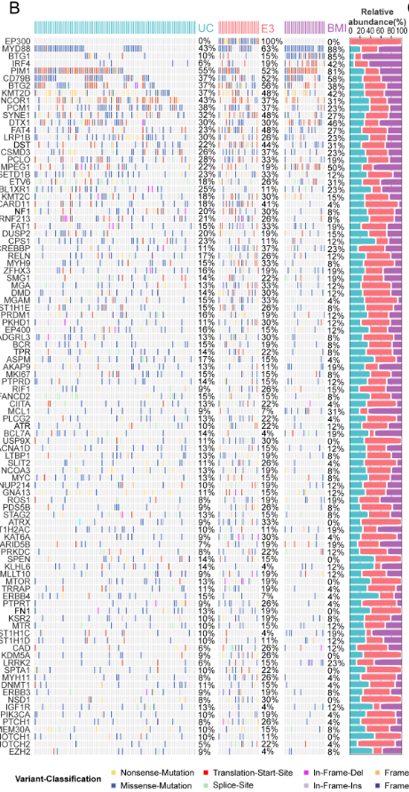
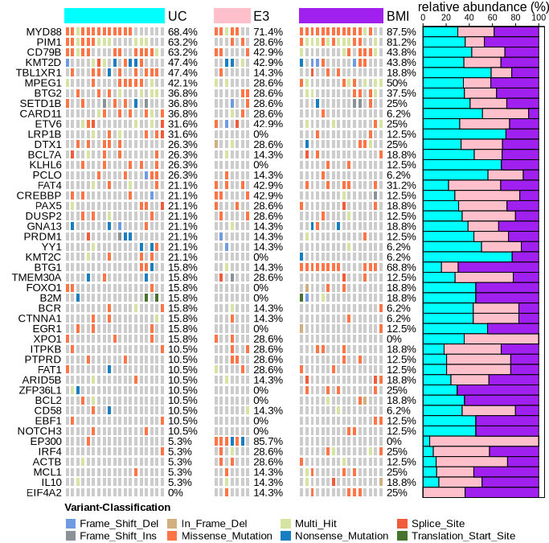

## 引言

[ComplexHeatmap](https://github.com/jokergoo/ComplexHeatmap)是R语言中一款功能强大、专门用于绘制热图的包。它的高灵活性和高度定制化使其广泛应用于多个领域的研究文章中。

ComplexHeatmap 的官方教程可在[此处](https://jokergoo.github.io/ComplexHeatmap-reference/book/index.html)找到，在具体使用功能时，推荐参考这个[API文档](https://jokergoo.github.io/ComplexHeatmap/reference/index.html)。

本文将以肿瘤基因突变数据为例，展示如何使用ComplexHeatmap制作可用于SCI级别论文发表的热图。

## 目标图片

<div style="text-align: center;">
  
  <p>需要制作的热图</p>
</div>

### 图片分析

目标图片具有以下特点：

- 主体部分由三个 oncoprint (瀑布图) 组成

- rowname (基因名) 位于第一张子图左侧

- 每张子图的右侧都标注了基因的出现频率

- 第三张子图的右侧有一个相对丰度的 barplot

- 每张子图的上方有样本类型的标注

- 图例在图片的下方，横向排布

## 图片绘制

### 数据处理

在绘制复杂的热图之前，必须对原始数据进行适当的处理和整理。以下步骤详细说明了如何从原始MAF文件中提取和整理肿瘤基因突变数据，以生成适合绘制Oncoprint图的矩阵。

#### 加载必要的R包

首先，加载所需的R包，包括 `ComplexHeatmap` 用于绘图，`maftools` 用于处理MAF文件，`readxl` 用于读取Excel文件，以及其他辅助包如`circlize` 和`tidyverse`。

```r
require(ComplexHeatmap)
require(maftools)
require(readxl)
require(circlize)
require(tidyverse)
require(ggsci)
```

#### 导入和合并MAF文件

MAF（Mutation Annotation Format）文件包含了肿瘤样本的基因突变信息。我们从不同目录中读取MAF文件，并将它们合并为一个统一的MAF对象，便于后续分析。

```r
# 定义MAF文件路径
ds_norm_maf_files <- list.files("path/to/ds/files/", pattern="\\.maf$", full.names=TRUE)
vs_norm_maf_files <- list.files("path/to/vs/files/", pattern="\\.maf$", full.names=TRUE)
norm_maf_files <- c(ds_norm_maf_files, vs_norm_maf_files)

# 合并MAF文件
norm_maf <- maftools:::merge_mafs(maf=norm_maf_files, verbose=TRUE)

# 过滤通过的突变
norm_maf <- subsetMaf(norm_maf, query = "FILTER == 'PASS'")
```

#### 筛选相关基因

为了聚焦于与癌症相关的基因，我们从一个包含癌症相关基因列表的文件中读取基因符号，并筛选出这些基因的突变信息。

如果没有特定的基因列表，此步骤可跳过。

```r
# 读取癌症相关基因列表
cr <- read.csv("path/to/cancer_related_genes.txt", sep = '\t')

# 筛选相关基因的突变
norm_maf <- subsetMaf(norm_maf, genes = cr$Hugo_Symbol)
```

#### 分类样本

根据基因突变情况将样本分类为三类：UC、E3和BMI。定义一个函数`classify_sample`，根据特定基因的突变存在与否对样本进行分类。

如果有样本分类的Excel文件，可以直接读入，进行分组。

```r
# 定义分类函数
classify_sample <- function(x) {
  uni <- unique(x)
  subtype = ""
  if("EP300" %in% uni) {
    subtype <- "E3"
  }
  else if(length(setdiff(c("BTG1", "MYD88", "IRF4"), uni)) <= 1) {
    subtype <- "BMI"
  }
  else {
    subtype <- "UC"
  }
  subtype
}

# 读取样本分类数据
tb <- read_xlsx('path/to/sample_data.xlsx', skip = 1)

# 应用分类函数
subtypes <- tb %>%
  group_by(Tumor_Sample_Barcode) %>%
  summarise(subtype = classify_sample(Hugo_Symbol))
```

#### 提取各类样本的突变矩阵

根据分类结果，将样本划分为UC、E3和BMI三类，并为每类样本生成独立的突变矩阵。每个矩阵的横轴为基因，纵轴为样本，值为突变信息。

```r
# 提取各类样本的名称
E3_samples <- subtypes %>% filter(subtype == 'E3') %>% .$Tumor_Sample_Barcode
BMI_samples <- subtypes %>% filter(subtype == 'BMI') %>% .$Tumor_Sample_Barcode
UC_samples <- subtypes %>% filter(subtype == 'UC') %>% .$Tumor_Sample_Barcode

# 根据样本名称提取矩阵
E3_sample_names <- c()
for(sample_name in colnames(mat)){
  for(pattern in E3_samples) {
    if(str_detect(sample_name, pattern)) {
      E3_sample_names <- c(E3_sample_names, sample_name)
      break
    }
  }
}

BMI_sample_names <- c()
for(sample_name in colnames(mat)){
  for(pattern in BMI_samples) {
    if(str_detect(sample_name, pattern)) {
      BMI_sample_names <- c(BMI_sample_names, sample_name)
      break
    }
  }
}

UC_sample_names <- c()
for(sample_name in colnames(mat)){
  for(pattern in UC_samples) {
    if(str_detect(sample_name, pattern)) {
      UC_sample_names <- c(UC_sample_names, sample_name)
      break
    }
  }
}

# 分别提取各类样本的突变矩阵
UC_mat <- mat[, UC_sample_names]
E3_mat <- mat[, E3_sample_names]
BMI_mat <- mat[, BMI_sample_names]
```

#### 准备颜色映射

为不同的突变类型分配颜色，以便在热图中清晰区分。使用`ggsci`包中的`pal_simpsons`调色板为每种突变类型生成独特的颜色。

```r
# 读取突变矩阵
df <- read.csv('path/to/onco_matrix.txt', sep = '\t', check.names=FALSE)
mat <- as.matrix(df)
mat[mat == 0] <- ""

# 生成颜色映射
col = c()
for(i in 1:length(sort(unique(as.vector(mat))))){
  if(sort(unique(as.vector(mat)))[i] != "") {
    col[sort(unique(as.vector(mat)))[i]] = pal_simpsons("springfield")(length(sort(unique(as.vector(mat)))))[i]
  }
}
```

### 图片绘制

利用`ComplexHeatmap`包，我们将处理好的数据绘制成专业级的 Oncoprint 图。以下步骤详细描述了从颜色设置到最终图形输出的整个过程。

#### 定义图形元素的绘制函数

通过定义`alter_fun`列表，指定不同类型突变的绘制方式。背景设置为灰色，每种突变类型使用之前定义的颜色进行填充。

```r
# 定义alter_fun列表
alter_fun <- list()
alter_fun[["background"]] <- function(x, y, w, h) {
  grid.rect(x, y, w-unit(2, "pt"), h-unit(2, "pt"),
            gp = gpar(fill = "#CCCCCC", col = NA))
}

# 为每种突变类型添加绘制函数
for(i in 1:length(sort(unique(as.vector(mat))))){
  if(sort(unique(as.vector(mat)))[i] != "") {
    f_generator <- function(i) {
      force(i)
      return (function(x, y, w, h) {
        grid.rect(x, y, w-unit(2, "pt"), h-unit(2, "pt"),
                  gp = gpar(fill = col[sort(unique(as.vector(mat)))[i]], col = NA))
      })
    }
    alter_fun[[sort(unique(as.vector(mat)))[i]]] <- f_generator(i)
  }
}
```

#### 计算并添加相对丰度注释

为了展示每种基因突变在不同样本类别中的相对丰度，计算各类样本中基因突变的百分比，并将其作为条形图注释添加到热图的右侧。

```r
# 计算各类样本中基因突变的百分比
UC_pct <- rowSums(UC_mat != "") / ncol(UC_mat) * 100
E3_pct <- rowSums(E3_mat != "") / ncol(E3_mat) * 100
BMI_pct <- rowSums(BMI_mat != "") / ncol(BMI_mat) * 100

# 合并为一个矩阵并归一化
pct_matrix <- cbind(UC_pct, E3_pct, BMI_pct)
pct_matrix <- t(apply(pct_matrix, 1, function(x) x / sum(x) * 100))
colnames(pct_matrix) <- c("UC", "E3", "BMI")

# 创建条形图注释
ha = rowAnnotation("relative abundance (%)" =
  anno_barplot(
    pct_matrix,
    gp = gpar(fill = c("cyan", "pink", "purple")),
    bar_width = 1,
    width = unit(4, "cm"),
    axis_param = list(
      side = "top",
      at = seq(0, 100, by = 20),
      labels_rot = 0
    )
  ),
  annotation_name_side = "top"
)
```

#### 创建各类样本的Oncoprint图

分别为UC、E3和BMI三类样本生成Oncoprint图，并添加相应的注释和图例。

```r
# 创建UC类别的Oncoprint图
top_anno_uc <- HeatmapAnnotation(UC = rep("UC", ncol(UC_mat)),
                                 show_legend = FALSE,
                                 col = list(UC = c("UC" = "cyan")))
oncop_uc <- oncoPrint(UC_mat,
                      alter_fun = alter_fun,
                      alter_fun_is_vectorized = FALSE,
                      col = col,
                      top_annotation = top_anno_uc,
                      right_annotation = NULL,
                      pct_digits = 1,
                      row_names_side = "left",
                      pct_side = "right",
                      show_heatmap_legend = FALSE
)

# 创建E3类别的Oncoprint图
top_anno_e3 <- HeatmapAnnotation(E3 = rep("E3", ncol(E3_mat)),
                                 show_legend = FALSE,
                                 col = list(E3 = c("E3" = "pink")))
oncop_e3 <- oncoPrint(E3_mat,
                      alter_fun = alter_fun,
                      alter_fun_is_vectorized = FALSE,
                      col = col,
                      top_annotation = top_anno_e3,
                      right_annotation = NULL,
                      show_row_names = TRUE,
                      row_names_side = "left",
                      row_names_gp = gpar(fontsize = 0),
                      show_pct = TRUE,
                      pct_side = "right",
                      pct_digits = 1,
                      show_heatmap_legend = FALSE
)

# 创建BMI类别的Oncoprint图
top_anno_bmi <- HeatmapAnnotation(BMI = rep("BMI", ncol(BMI_mat)),
                                  show_legend = FALSE,
                                  col = list(BMI = c("BMI" = "purple")))
oncop_bmi <- oncoPrint(BMI_mat,
                       alter_fun = alter_fun,
                       alter_fun_is_vectorized = FALSE,
                       col = col,
                       top_annotation = top_anno_bmi,
                       right_annotation = ha,
                       heatmap_legend_param = list(
                         title = "Variant-Classification",
                         at = sort(unique(as.vector(mat)))[nzchar(sort(unique(as.vector(mat))))],
                         labels = sort(unique(as.vector(mat)))[nzchar(sort(unique(as.vector(mat))))],
                         nrow = 2
                       ),
                       show_row_names = TRUE,
                       row_names_side = "left",
                       row_names_gp = gpar(fontsize = 0),
                       show_pct = TRUE,
                       pct_side = "right",
                       pct_digits = 1,
)
```

#### 整合并输出最终热图

将三个 Oncoprint 图整合在一起，并调整布局以确保图例位于图形下方，整体美观且信息传达清晰。

```r
# 设置PNG输出参数
png(file="output_path/fig_5b_oncoprint.png",
    width = 2000, height = 6000)

# 整合三个Oncoprint图
ht_list = oncop_uc + oncop_e3 + oncop_bmi

# 绘制整合后的热图
draw(ht_list,
     merge_legend = TRUE,
     auto_adjust = FALSE,
     heatmap_legend_side = "bottom",  # 将图例放置在下方
     padding = unit(c(2, 10, 2, 2), "mm")  # 调整边距
)

# 关闭设备
dev.off()
```

#### 详细说明各绘图步骤对应图片分析的特点

- **主体部分由三个Oncoprint（瀑布图）组成**：通过`oncop_uc`、`oncop_e3`和`oncop_bmi`三个`oncoPrint`对象分别绘制UC、E3和BMI三类样本的突变分布图，并通过`ht_list = oncop_uc + oncop_e3 + oncop_bmi`将它们整合在一起。

- **Rowname（基因名）位于第一张子图左侧**：在绘制`oncop_uc`时，`row_names_side = "left"`确保基因名显示在热图的左侧。

- **每张子图的右侧都标注了基因的出现频率**：对于`oncop_uc`和`oncop_e3`，虽然没有具体添加基因出现频率的注释，但可以通过`oncoPrint`函数的参数`show_pct`和`pct_digits`来显示突变频率。

- **第三张子图的右侧有一个相对丰度的barplot**：通过在`oncop_bmi`的`right_annotation`参数中添加`ha`（包含相对丰度的条形图注释），实现了在第三张子图右侧添加相对丰度条形图。

- **每张子图的上方有样本类型的标注**：通过`HeatmapAnnotation`对象`top_anno_uc`、`top_anno_e3`和`top_anno_bmi`，在每个Oncoprint图的上方添加了样本类型的标注（UC、E3、BMI）。

- **图例在图片的下方，横向排布**：在`draw`函数中，通过`heatmap_legend_side = "bottom"`将图例放置在图形下方，并通过`merge_legend = TRUE`将所有图例合并为一个横向排列的图例。

### 结果

<div style="text-align: center;">
  
  <p>结果示例</p>
</div>

### 总结

本文详细介绍了如何使用R语言中的`ComplexHeatmap`包绘制专业级的Oncoprint图，以展示肿瘤样本中基因突变的分布情况。通过数据的预处理、样本分类、颜色映射的设置以及多层注释的添加，最终生成了一个信息丰富且视觉效果出众的热图。`ComplexHeatmap`的高度定制化功能使其在科研数据可视化中成为不可或缺的工具，适用于各类复杂数据的展示需求。

### 参考文献与资源

- [Zuguang Gu的ComplexHeatmap官方文档](https://jokergoo.github.io/ComplexHeatmap-reference/book/index.html)

- [ComplexHeatmap API文档](https://jokergoo.github.io/ComplexHeatmap/reference/index.html)

- [ggsci R包](https://github.com/road2stat/ggsci)的调色方案

- [`maftools`包的官方文档](https://bioconductor.org/packages/release/bioc/html/maftools.html)
