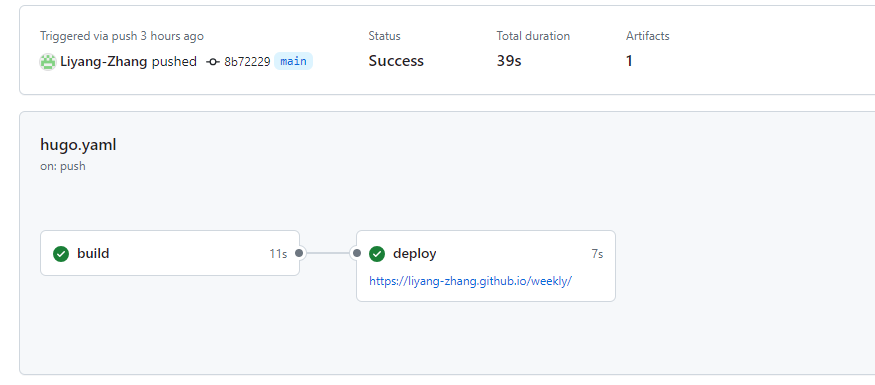
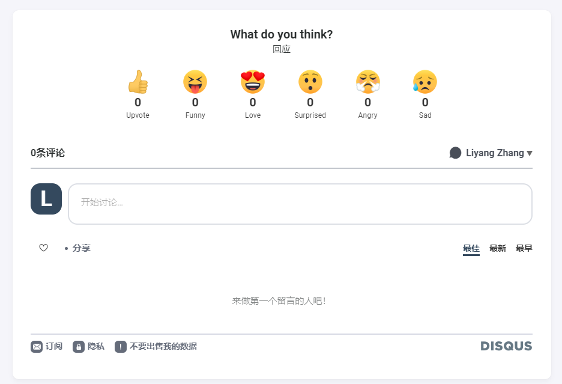

本文记录了我从零开始使用Hugo搭建个人网站的过程，使用的是最新的 extended release 版本 (v0.131.0)，并采用 [CaiJimmy 的 hugo-theme-stack](https://github.com/CaiJimmy/hugo-theme-stack)。同时，还将介绍如何将站点上传到 GitHub，并使用 GitHub Pages 进行部署。

## 下载和安装 Hugo

首先，下载并安装 Hugo 的最新 extended release 版本（以下只展示我在WSL2上的安装过程）。

### 下载 Hugo

访问 [Hugo Releases 页面](https://github.com/gohugoio/hugo/releases)并下载最新的 extended release 版本。

### 安装 Hugo

使用 tar.gz 文件安装 Hugo：

```bash
wget https://github.com/gohugoio/hugo/releases/download/vX.X.X/hugo_extended_X.X.X_Linux-64bit.tar.gz
tar -zxvf hugo_extended_X.X.X_Linux-64bit.tar.gz
sudo mv hugo /usr/local/bin/
```

可以通过以下命令检查是否安装成功：

```bash
hugo version
```

## 创建项目，配置站点

### 创建新站点

使用 Hugo 创建一个新的站点：

```bash
hugo new site mywebsite
cd mywebsite
```

### 配置站点

打开 `config.toml` 文件，根据自己的需要进行配置，例如站点名称、语言等：

```toml
baseURL = 'https://yourdomain.url/'
languageCode = 'en-us'
title = 'My Hugo Website'
theme = 'hugo-theme-stack'
```

## 下载模板，配置模板

### 下载主题

在站点目录下使用 Git 下载主题：

```bash
git init
git submodule add https://github.com/CaiJimmy/hugo-theme-stack themes/hugo-theme-stack
```

### 配置主题

此处参考hugo-theme-stack的[template](https://github.com/CaiJimmy/hugo-theme-stack-starter)进行配置

主要需要修改的有config和content这两个目录，此处只展示config相关的部分配置：

1. 删除原有的`hugo.toml`文件

2. 使用hugo支持的config目录方式进行配置，在项目目录下创建`config`目录, 目录内应包含以下文件：

    ```bash
    config/
    └── _default
        ├── _languages.toml
        ├── hugo.toml
        ├── markup.toml
        ├── menu.toml
        ├── params.toml
        ├── permalinks.toml
        └── related.toml
    ```
3. 参照模板修改各个toml的内容，以hugo.toml为例：
    ```toml
    # Change baseurl before deploy
    baseurl = "https://yourdomain.url/"
    languageCode = "zh-cn"
    paginate = 5
    title = "Weekly"
    theme = "hugo-theme-stack"

    # Theme i18n support
    # Available values: en, fr, id, ja, ko, pt-br, zh-cn, zh-tw, es, de, nl, it, th, el, uk, ar
    defaultContentLanguage = "zh-cn"

    # Set hasCJKLanguage to true if DefaultContentLanguage is in [zh-cn ja ko]
    # This will make .Summary and .WordCount behave correctly for CJK languages.
    hasCJKLanguage = true

    # Change it to your Disqus shortname before using
    disqusShortname = "zhangly-link"

    timeZone = "Asia/Shanghai"
    ```

可以根据主题文档进一步配置主题参数。

## 上传到 GitHub

### 初始化 Git 仓库

在项目根目录下初始化 Git 仓库并添加所有文件：

```bash
git init
git add .
git commit -m "Initial commit"
```

### 推送到 GitHub

在 GitHub 上创建一个新的仓库，然后将本地仓库推送到远程仓库：

```bash
git remote add origin https://github.com/yourusername/mywebsite.git
git branch -M main
git push -u origin main
```

## 使用 GitHub Pages 部署

基本可以参考[Hugo hosting-on-github](https://gohugo.io/hosting-and-deployment/hosting-on-github/)进行部署，唯一需要注意的是如果之前的github access token没有workflow权限的话需要新生成一个。

### 配置 GitHub Pages

在 GitHub 仓库中，进入 `Settings` -> `Pages`，选择 `main` 分支并将其源更改为 GitHub Actions。

### 部署站点

在本地创建一个 GitHub Actions 工作流程文件，以便在每次推送到 `main` 分支时自动构建和部署您的 Hugo 站点。

1. 创建 `.github/workflows/hugo.yml` 文件，并添加以下内容：

```yaml
name: Deploy Hugo site to Pages

on:
  push:
    branches:
      - main
  workflow_dispatch:

permissions:
  contents: read
  pages: write
  id-token: write

concurrency:
  group: "pages"
  cancel-in-progress: false

jobs:
  build:
    runs-on: ubuntu-latest
    env:
      HUGO_VERSION: 0.128.0
    steps:
      - name: Install Hugo CLI
        run: |
          wget -O ${{ runner.temp }}/hugo.deb https://github.com/gohugoio/hugo/releases/download/v${HUGO_VERSION}/hugo_extended_${HUGO_VERSION}_linux-amd64.deb \
          && sudo dpkg -i ${{ runner.temp }}/hugo.deb
      - name: Checkout
        uses: actions/checkout@v4
        with:
          submodules: recursive
          fetch-depth: 0
      - name: Setup Pages
        id: pages
        uses: actions/configure-pages@v5
      - name: Build with Hugo
        env:
          HUGO_CACHEDIR: ${{ runner.temp }}/hugo_cache
          HUGO_ENVIRONMENT: production
        run: |
          hugo --gc --minify --baseURL "${{ steps.pages.outputs.base_url }}/"
      - name: Upload artifact
        uses: actions/upload-pages-artifact@v3
        with:
          path: ./public

  deploy:
    environment:
      name: github-pages
      url: ${{ steps.deployment.outputs.page_url }}
    runs-on: ubuntu-latest
    needs: build
    steps:
      - name: Deploy to GitHub Pages
        id: deployment
        uses: actions/deploy-pages@v4
```

2. 提交并推送更改：

```bash
git add .github/workflows/hugo.yml
git commit -m "Add GitHub Actions workflow for Hugo"
git push origin main
```

### 访问站点

进入github action界面，待github pages deploy完成后，就可以通过界面上的链接访问部署完成的Hugo站点。

<div style="text-align: center;">
  
  <p>部署成功后的截图</p>
</div>

<div style="text-align: center;">
  <hr style="width: 80%;">
</div>

至此，Hugo 个人站点已经成功被搭建，并使用 GitHub Pages 进行了部署。如果在此过程中遇到问题，可以参考 Hugo 和 GitHub Pages 的官方文档，或者在相关社区中寻求帮助。

## 更新：添加评论功能

为了在 Hugo 站点中添加评论功能，可以使用 Disqus。以下是具体步骤：

1. 在 [Disqus 网站](https://disqus.com/)注册账号，并注册一个站点，拿到 `shortname`。
2. 在 Disqus 的设置（Settings）中的高级（Advanced）选项中，将自己的域名和 GitHub Pages 解析后的域名都添加到信任列表（Trusted Domains）中。
3. 在 `hugo.toml` 文件中添加 `disqusShortname` 参数，值为您的 shortname。
4. 推送修改，即可生效。

<div style="text-align: center;">
  
  <p>成功后的评论区示例</p>
</div>

需要注意的是，Disqus 在本地预览中不会生效，另外Disqus 在中国大陆需要使用代理访问。
